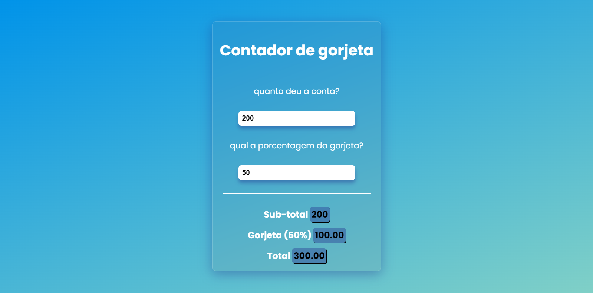
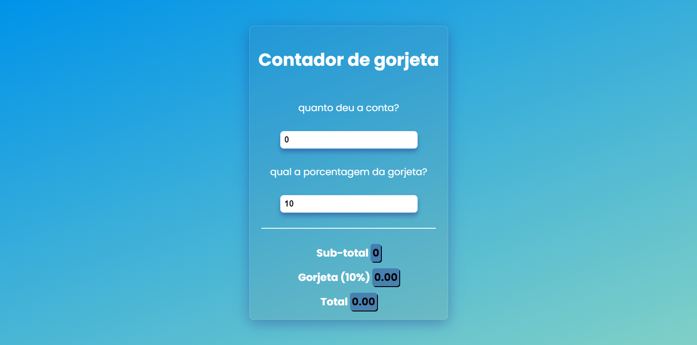

# Calculadora de gorjeta

# Sobre o projeto:

A **Calculador de Gorjeta** é uma aplicação desenvolvida na minha série de estudos em **React.js**  A aplicação busca entregar rapidamente o valor total de uma determinada quantia com base na gorjeta/juros informado pelo usuário.

## Layout web

# Tecnologias utilizadas

## Front end
- ReactJS

# Autore

**https://www.linkedin.com/in/matheus-santos-maia/**
